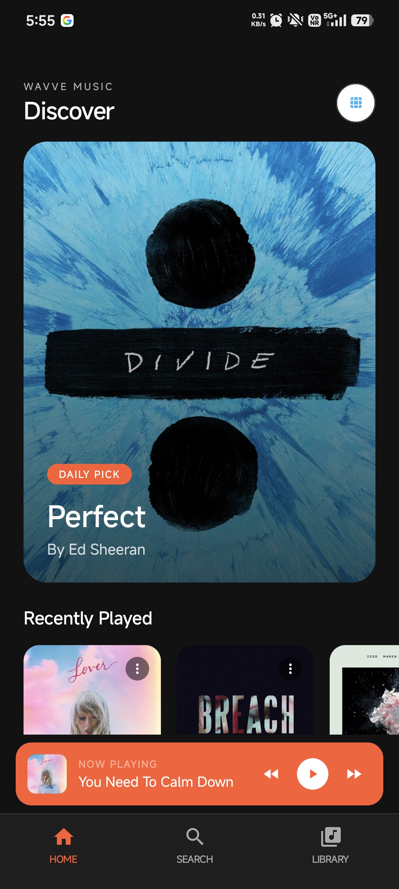
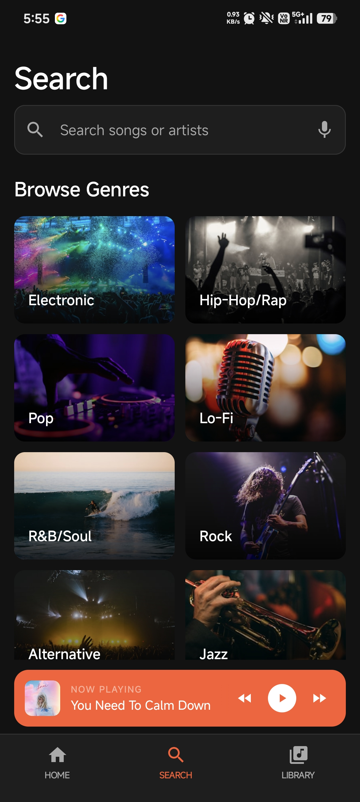
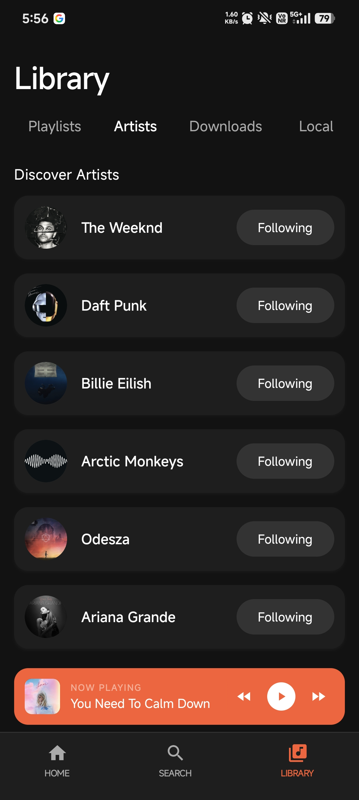
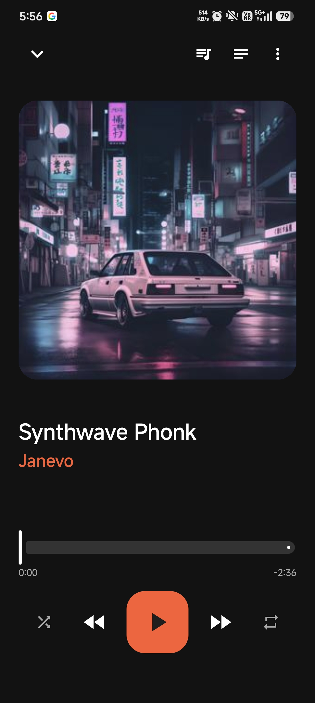
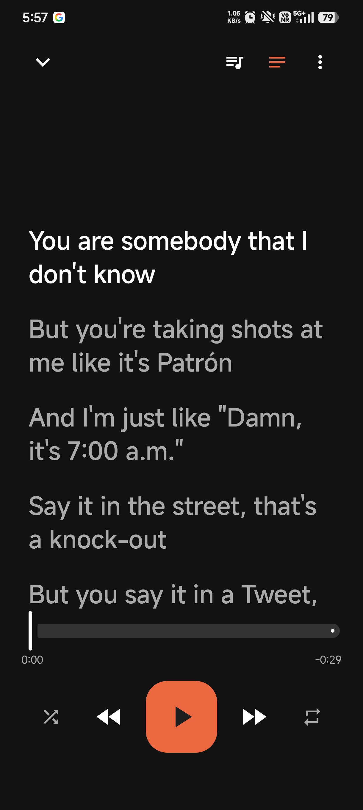
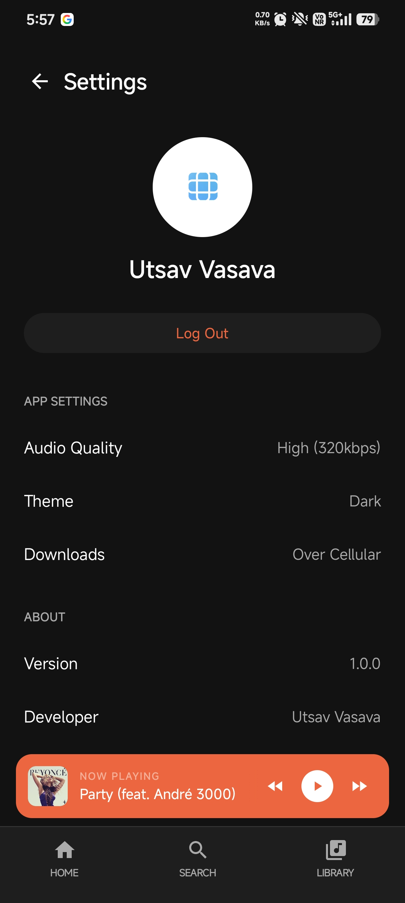

<p align="center">
  
</p>

<h1 align="center">Wavve</h1>

<p align="center">
  
  
  
  
  
  
</p>

---

<p align="center">
  A minimalist, editorial-grade music streaming application inspired by the design languages of Apple Music and Spotify. Built entirely with modern Android development standards, the app serves as a comprehensive showcase of scalable architecture, background media processing, and polished user interface design.
</p>

---

## Screenshots

<p align="center">
  
  
  
</p>
<p align="center">
  
  
  
</p>

---

## Tech Stack

The application is built natively for Android using a modern Kotlin and Jetpack Compose stack:

*   **Language:** Kotlin
*   **UI Framework:** Jetpack Compose
*   **Architecture:** MVVM (Model-View-ViewModel) with unidirectional data flow
*   **Media Playback:** AndroidX Media3 (ExoPlayer) & MediaLibraryService for background audio
*   **Asynchronous Programming:** Kotlin Coroutines and StateFlow
*   **Backend & Authentication:** Firebase Auth, Firebase Firestore
*   **Local Storage:** Room Database and SharedPreferences (State persistence)
*   **Image Loading:** Coil
*   **Networking:** Retrofit / OkHttp (REST API integrations)

## Features

*   Stream a dual-catalog of music (Commercial tracks & Full Indie library)
*   Full background playback with MediaSession and lock screen integration
*   Search for songs, albums, and artists globally
*   Fetch and display real-time synchronized LRC lyrics
*   Cloud playlist management and library syncing via Firebase
*   Generate native Android deep links to seamlessly share your custom playlists with friends
*   Save favorite artists and tracks to your personal library
*   Persistent playback queue (restores exact song and millisecond timestamp on restart)
*   Add, remove, or play directly from the 'Up Next' queue
*   Cross-device account authentication
*   Native Android 13+ Photo Picker for profile customization
*   Local search history caching (re-search in one tap)
*   Dynamic 'Recently Played' tracking and smart recommendations
*   Beautiful, native Jetpack Compose UI (Marquee scrolling, fading edges, fluid sliders)
*   Material 3 Modal Bottom Sheets for extensive track options
*   Hardware media button support (Bluetooth headphones, car audio)

## Limitations

*   **30-Second Commercial Previews:** Because Wavve is a non-commercial portfolio project, it does not have licensing agreements with major record labels. To comply with copyright laws, mainstream commercial tracks (fetched via the iTunes API) are strictly limited to 30-second audio previews. Full-length playback is only available for independent, royalty-free tracks sourced from the Jamendo catalog.
*   **Lyrics Availability:** Synchronized lyrics are dependent on the public [LRCLIB](https://lrclib.net) database. If a specific track's LRC data is missing from the database, the lyrics view will display a "Not Available" state.

## Credits & APIs

Wavve relies on the following public APIs to populate its content:

*   **iTunes Search API:** For mainstream track metadata and audio previews.
*   **Jamendo API:** For independent music and full-length royalty-free streaming.
*   **[LRCLIB](https://lrclib.net):** For retrieving synchronized song lyrics.
*   **DiceBear API:** For generating fallback user profile avatars.

## Building from Source

1.  **Clone the repository**
    ```bash
    git clone https://github.com/festverse/Wavve-Music.git
    cd Wavve-Music
    ```

2.  **Set up Firebase**
    - Create a Firebase project at [console.firebase.google.com](https://console.firebase.google.com)
    - Enable **Authentication** (Email/Password and Google Sign-In)
    - Enable **Cloud Firestore**
    - Download `google-services.json` and place it in the `app/` directory

3.  **Configure environment variables**
    - Copy `.env.example` to `.env`
    - Fill in your API keys:
      ```
      GEMINI_API_KEY=your_gemini_api_key_here
      ```

4.  **Open in Android Studio** and sync Gradle. Build and run on your device or emulator.

## License

© 2026 Utsav Vasava. All Rights Reserved.

This project and its source code are provided for demonstration and portfolio purposes. You may view and learn from the code, but you may not copy, modify, distribute or use it for commercial purposes without explicit permission.
